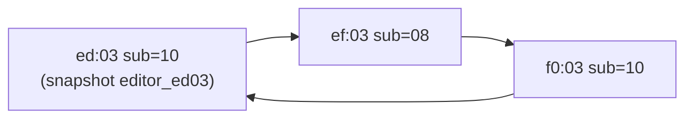

# HXLinux — Référence protocole USB HX Stomp XL

**Date** : mai 2026  
**Auteurs** : Reverse engineering par captures Wireshark/USBPcap + analyse comparative HX Edit / HXLinux  
**Hardware** : Line 6 HX Stomp XL (`VID=0x0E41`, `PID=0x4253`)

**Documents liés** :

- [analyse-compteurs-preset-hx-vs-linux.md](./analyse-compteurs-preset-hx-vs-linux.md) — comparaison HX Edit / Linux, matrice de captures
- `scripts/analyze_ed03_captures.py` — extraction des doubles ED03 depuis JSON Wireshark

---

## 1. Architecture USB

### 1.1 Identification du device

```
idVendor  : 0x0E41  (Line 6)
idProduct : 0x4253  (HX Stomp XL)
bDeviceClass : 0xEF  (Composite Device)
```

Le Stomp XL est un **composite device** exposant plusieurs interfaces simultanément :

| Interface | Classe | Rôle |
|-----------|--------|------|
| `MI_00` | `0xFF` Vendor Specific | Protocole propriétaire HX Edit — **c'est celle-ci** |
| `MI_01` | `MEDIA` | Carte son USB |
| `MI_02` | MIDI standard | Program Change, CC |
| `MI_03+` | HID | Contrôleur physique |

**Numéros d'interface sous Linux (libusb)** — ne pas confondre avec `MI_xx` du descripteur USB :

| `claim_interface(n)` | Rôle dans HXLinux |
|------------------------|-------------------|
| `0` | Vendor — bulk `0x01` / `0x81` (protocole HX Edit) |
| `4` | MIDI — bulk `0x82` (Program Change, écho preset) |

### 1.2 Transport

HX Edit **bypasse complètement CoreMIDI/ALSA** et parle directement sur l'interface vendor specific (`bInterfaceClass: 0xFF`).

- **Endpoint OUT** : `0x01` (host → device) — `URB_BULK` (vendor, interface 0)
- **Endpoint IN** : `0x81` (device → host) — `URB_BULK` (vendor)
- **Endpoint IN MIDI** : `0x82` — `URB_BULK` (interface 4, thread MIDI séparé dans HXLinux)
- **Endpoint HID** : `0x84` — polling toutes les ~8ms (ne pas confondre avec le vendor)

### 1.3 Capture sous Windows

Outil : Wireshark + USBPcap

```
# Identifier l'adresse du Stomp
Get-PnpDeviceProperty -InstanceId "USB\VID_0E41&PID_4253\<serial>" `
    -KeyName DEVPKEY_Device_LocationPaths | Select-Object -ExpandProperty Data

# Filtre Wireshark (remplacer X par l'adresse device)
usb.device_address == X

# Ou par VID (universel, adresse-indépendant)
usb.idVendor == 0x0e41
```

### 1.4 Capture sous Linux

```bash
sudo modprobe usbmon
sudo usermod -a -G wireshark $USER
```

Interfaces disponibles dans Wireshark : `usbmon0`, `usbmon1`, `usbmon2`...  
Filtre identique à Windows.

---

## 2. Structure générale des trames

### 2.1 Format d'une trame 16 bytes (keep-alive / ACK)

```
Offset  Taille  Contenu
0–3     4       Header : longueur + commande (ex. 08:00:00:18)
4–7     4       Opcode (direction encodée : OUT = 80:10:ed:03, IN = ed:03:80:10)
8       1       0x00
9       1       Compteur de séquence (x80_cnt, x1_cnt ou x2_cnt selon l'opcode)
10      1       0x00
11      1       Sub-type : 0x02=variante observée (≠ teardown — voir §12), 0x04=data, 0x08=ACK, 0x0C=phase2, 0x10=poll
12–13   2       Double (bytes variables selon la lane — voir §4)
14–15   2       0x00:0x00
```

### 2.2 Format d'une trame 36 bytes (requête éditeur)

```
Offset  Taille  Contenu
0–3     4       Header (ex. 19:00:00:18 ou 1b:00:00:18)
4–7     4       Opcode (80:10:ed:03)
8–9     2       0x00 + x80_cnt
10–11   2       0x00 + sub (0x04 ou 0x0C)
12–15   4       Session + double (lane éditeur ou live_write_ctr)
16–23   8       Constante (01:00:06:00:09:00:00:00 ou variante)
24–27   4       Namespace + lane : 83:66:cd:XX
28–31   4       sess_id + 0x64 + suffixe (0x17:65 ou 0x16:65)
32–35   4       Constante (c0:00:00:00 ou variante)
```

### 2.3 Format d'une trame write parameter (48 bytes)

Structure utilisée pour modifier un paramètre en temps réel (knob, etc.) :

```
Offset  Contenu
0–3     27:00:00:18  (header)
4–7     80:10:ed:03  (opcode write param)
8–11    00:SEQ:00:04  (SEQ = numéro séquence)
12–15   CTR_L:CTR_H:00:00  (compteur transaction 16-bit LE, +0x19 entre trames)
16–23   01:00:06:00:17:00:00:00  (constante)
24–27   83:66:cd:PP  (PP = index paramètre, 0x03 = premier param du model)
28–31   YY:64:1e:65  (YY = index local)
32–42   85:62:01:1d:c3:1a:00:1c:00:77:ca  (constante)
43–46   F0:F1:F2:F3  (valeur float IEEE 754 Big-Endian, 0.0 à 1.0)
47      00           (terminateur)
```

---

## 3. Les trois opcodes principaux

| Opcode OUT (host→device) | Opcode IN (device→host) | Canal | Rôle |
|--------------------------|-------------------------|-------|------|
| `80:10:ed:03` | `ed:03:80:10` | x80 | Éditeur/preset/keep-alive |
| `01:10:ef:03` | `ef:03:01:10` | x1  | Keep-alive secondaire |
| `02:10:f0:03` | `f0:03:02:10` | x2  | Poll slot / notifications |

---

## 4. Les lanes de compteurs

**Règle fondamentale** : HX Edit maintient **plusieurs compteurs indépendants**. Les mélanger provoque des désynchronisations et des réponses incorrectes du Stomp.

### 4.1 `editor_ed03_double` — Lane éditeur (bytes 28–29 des OUT 36 bytes)

- **Plage** : `0x64xx` (octet haut ≈ `0x64`)
- **Valeur initiale** : `0x64E8` (observée HX Edit cold boot)
- **Incrément** : `+1` à chaque OUT 36 bytes `cd:03`
- **Figé** après init pour le keep-alive (snapshot, Δ=0 entre cycles)
- **Utilisé par** : `editor_phase4_bootstrap.rs`, `request_preset.rs` (phases 1 et 2), `slot_model_hw_pull.rs` (pull `1b`/`19`)
- **Ne pas utiliser pour** : ACK chunks dump preset, live write

```
Phase 4 bootstrap : e8:64 → ea:64 → eb:64 → (ec:64 pour la suite)
Keep-alive ed sub=10 : snapshot figé à ec:64 (Δ=0 entre cycles)
```

### 4.2 `preset_dump_ack_ctr` — Lane dump preset (bytes 12–13 des ACK sub=08)

- **Plage** : `XX:YY` où `XX` = valeur de session stable par dump, `YY` s'incrémente de `+1`
- **Valeur initiale** : aléatoire par session (ex. `9d:11`, `89:6e`, `6a:93`)
- **Incrément** : `+1` (octet bas uniquement) à chaque chunk ACKé
- **Utilisé par** : `request_preset.rs` (ACK chunks 272 bytes), `standard.rs` (ACK `f0:03` sub=08), `request_preset_name.rs`
- **Ne pas utiliser pour** : trames éditeur 36 bytes, live write

```
HX Edit observé : 9d:11 → 9d:12 → 9d:13 → ... → 9d:1b → 64:1c
```

### 4.3 `live_write_ctr` — Lane live write (bytes 12–13 des OUT live write)

- **Incrément standard** : `+0x1F` entre trames write classiques
- **Incrément pull modèle** : `+0x31` entre les deux `19` de la séquence pull
- **Utilisé par** : `live_write.rs`, `slot_model_hw_pull.rs` (bytes 12–13 du `1b`)
- **Ne pas fusionner** avec les deux lanes ci-dessus

### 4.4 Compteurs de séquence (byte 9)

| Compteur | Canal | Incrément |
|----------|-------|-----------|
| `x80_cnt` | ed:03 | +1 à chaque OUT sur ce canal |
| `x1_cnt`  | ef:03 | +1 à chaque OUT sur ce canal |
| `x2_cnt`  | f0:03 | +1 à chaque OUT sur ce canal |

---

## 5. Séquence de connexion complète

### 5.1 Vue d'ensemble

```
1. Enumerate USB (GET DESCRIPTOR)
2. Negotiate + Subscribe (0c:00:00:28 puis 11:00:00:18) × 3 opcodes (ef/ed/f0)
3. Poll d'activation f0:03 sub=08 (09:10) — arme le canal f0
4. ReconfigureX1
5. Editor Phase 4 Bootstrap (3× OUT 19 ed + 1× OUT 1a ef)
6. Délai ~700ms (Stomp dump preset sur 0x81)
7. Keep-alive polling régulier : ed → ef → f0
```

### 5.2 Negotiate + Subscribe

Envoyés pour chaque opcode (`ef:03`, `ed:03`, `f0:03`) :

```
Negotiate : 0c:00:00:28:XX:10:YY:03:00:00:00:02:00:01:00:21:00:10:00:00
Subscribe : 11:00:00:18:XX:10:YY:03:00:02:00:04:00:10:00:00:01:00:ZZ:00:01:00:00:00:ZZ:00:00:00
```

Le Stomp répond avec `P36Main` dans la réponse subscribe ef.

### 5.3 Poll d'activation f0:03

**Critique** — sans ce poll, le Stomp n'émet jamais les notifications `f0:03:02:10`.

```
OUT : 08:00:00:18:02:10:f0:03:00:03:00:08:09:10:00:00  (sub=08, cnt=0x03)
IN  : 08:00:00:18:f0:03:02:10:00:03:00:08:09:02:00:00  (réponse Stomp)
```

Envoyé **15ms après** le handshake subscribe f0, avec `cnt = handshake_cnt + 1`.

### 5.4 Editor Phase 4 Bootstrap

```
19 #1 → double=e8:64 (0x64E8), sub=04, suffix=4c:65:80
19 #2 → double=ea:64 (0x64EA) — HX saute e9, hardcodé
19 #3 → double=eb:64 (0x64EB), suffix=16:65:c0
1a ef → double=e8:64 réutilisé (pas de next), suffix=cc:fe:65:80
```

Après cette séquence, `editor_ed03_double = 0x64EC` pour la suite.

### 5.5 Délai post-bootstrap

**700ms** avant de démarrer le keep-alive polling. Sans ce délai, le Stomp ignore les polls `f0:03` car il est encore en train de dumper le preset sur `0x81`.

---

## 6. Keep-alive polling régulier

Cycle ordonné **ed → ef → f0**, période ~1040ms, pause 28ms entre opcodes.



### 6.1 ed:03 (sub=10)

```
08:00:00:18:80:10:ed:03:00:cnt:00:10:session:double_lo:double_hi:00
```
- `session` = `session_no` au moment du démarrage du keep-alive (snapshot)
- `double` = snapshot de `editor_ed03_double` au démarrage (fixe, Δ=0)

### 6.2 ef:03 (sub=08)

```
08:00:00:18:01:10:ef:03:00:cnt:00:08:72:1e:00:00
```
- `72:1e` fixe (HX Edit utilise `ac:24` post-connect — valeur différente acceptée)

### 6.3 f0:03 (sub=10)

```
08:00:00:18:02:10:f0:03:00:cnt:00:10:09:10:00:00
```
- `09:10` fixe

---

## 7. Notifications du Stomp

### 7.1 Changement de slot (f0:03:02:10, 44 bytes)

Émis quand l'utilisateur change de slot sur le hardware.

```
byte[38] = numéro de slot actif (0x01 = slot 0, 0x02 = slot 1, etc.)
```

Requiert que le poll d'activation (§5.3) ait été fait au démarrage.

### 7.2 Slot actif dans le preset (82:62:SS)

Le marqueur `82:62:SS:1a` dans les trames IN indique le slot actif :
- `SS` = slot_bus (0x01 = slot 0)
- Présent dans les notifications `f0:03:02:10` 44 bytes head=`21` lors des changements de preset

**Source unique de vérité** : `hw_active_slot_bus` alimenté par `82:62:SS:1a` sur toute trame IN.

### 7.3 Changement de model (f0:03:02:10, 40 bytes)

Paire de notifications `1d` + `1f` émises quand l'utilisateur change de model sur un slot.

```
1d:00:00:18:f0:03:02:10:...:81:62:SS:...  (première)
1f:00:00:18:f0:03:02:10:...:81:62:SS:...  (deuxième)
```

- `81:62:SS` = slot_bus où le model a changé
- Déclencher la séquence pull **sur le `1f` uniquement** (debounce naturel de la paire)

---

## 8. Séquence pull modèle (1b + 19 + 19)

Déclenchée par la réception du `1f` 40 bytes.

### 8.1 OUT 1b (assign / lecture slot)

```
1b:00:00:18:80:10:ed:03:00:x80_cnt:00:04:live_write_ctr_L:live_write_ctr_H:00:00
:01:00:06:00:0b:00:00:00:83:66:cd:03
:editor_ed03_L:editor_ed03_H:2d:65:81:62:slot_bus:00
```

Envoyé **en rafale** avec le f0 interstitiel (pas de délai entre les deux) :

```
f0 interstitiel : 08:00:00:18:02:10:f0:03:00:x2_cnt:00:08:52:11:00:00
```

### 8.2 IN attendu après 1b

```
53:00:00:18:ed:03:80:10:... (92 bytes, head=0x53) ← réponse correcte
1c:00:00:18:ed:03:80:10:... (36 bytes, head=0x1c) ← réponse d'erreur
```

Si `1c` reçu → envoyer quand même les deux `19` en burst.

### 8.3 OUT 19 × 2 (méta)

```
19 #1 : ...83:66:cd:03:live_write_ctr_L:live_write_ctr_H:17:65:c0:00:00:00
19 #2 : ...83:66:cd:03:live_write_ctr_L:live_write_ctr_H:16:65:c0:00:00:00
```

Delta `live_write_ctr` entre les deux `19` : `+0x31` (49 décimal).

### 8.4 Extraction du module_hex

Dans les bulks reçus, chercher le pattern `0x19 ... 0x1a` :
```rust
// Entre 0x19 et 0x1a : bytes du chainHex du model
// Exemple : 0x19 0xcd 0x01 0xfe 0x1a → module_hex = "cd01fe"
```

---

## 9. Séquence de changement de preset

### 9.1 Notifications du Stomp (IN)

```
21:00:00:18:f0:03:02:10:...:82:62:SS:...  (44 bytes, slot actif)
1d:00:00:18:f0:03:02:10:...               (40 bytes, pré-notif)
21:00:00:18:f0:03:02:10:...:82:69:27:6a:...  (pattern secondaire)
21:00:00:18:f0:03:02:10:...:82:69:04:6a:...  (pattern principal — porte preset_index à byte[40])
```

### 9.2 ACKs requis (host → Stomp)

Chaque notification doit être ACKée avec `preset_dump_ack_ctr` :

```
08:00:00:18:02:10:f0:03:00:x2_cnt:00:08:dump_ack_lo:dump_ack_hi:00:00
```

---

## 10. Dump preset (RequestPreset)

### 10.1 Phase 1 (requête nom)

```
OUT 19 sub=04 : ...83:66:cd:cmd_type:sess_id:0x64:17:65:c0...
               bytes 12-15 : session_no + editor_ed03_double (sans incrément)
```

### 10.2 Phase 2 (requête données)

```
OUT 19 sub=0c : ...83:66:cd:cmd_type:sess_id:0x64:16:65:c0...
               bytes 12-15 : phase2_session + next_editor_ed03_double()
```

### 10.3 ACK par chunk (272 bytes reçus)

```
OUT 16 bytes sub=08 : ...80:10:ed:03:00:x80_cnt:00:08:phase2_session:dump_ack_lo:dump_ack_hi:00
```

Utilise **`preset_dump_ack_ctr`** — **pas** `editor_ed03_double`.

### 10.4 Liste des noms (RequestPresetNames) et UI

Les 125 noms sont d'abord stockés dans **`HelixState.preset_names`** (`got_preset_names = true`).  
L'UI Tauri lit **`AppState.preset_names`** via `get_preset_names()`.

Copie vers l'UI :

- au passage en mode **`Standard`** (`sync_app_presets_from_helix` dans `lib.rs`) ;
- à la volée si la liste AppState est encore vide : `get_preset_names()` / `get_active_preset()` relisent `HelixState`.

Sans cette sync, le bandeau peut afficher « HX Stomp XL connected » (device ouvert) alors que la liste presets reste vide jusqu'au mode Standard.

---

## 11. Paramètres en temps réel (write parameter)

### 11.1 Index paramètre

```
PP = 0x03 + (slot - 1) + (param_index - 1)
```

- `slot` : position du block dans le preset (1-based)
- `param_index` : position du paramètre dans le model JSON (1-based)

### 11.2 Encodage de la valeur

Float IEEE 754 **Big-Endian**, plage `0.0` à `1.0` normalisée.

```rust
fn encode_float(value: f32) -> [u8; 4] {
    value.to_be_bytes()
}
// Exemple : 0.65 → 3f:26:66:66
```

### 11.3 ChainHex des models

L'identifiant `83:66:cd:PP` dans les trames write parameter :
- `83:66` = namespace fixe (universel, tous models)
- `cd` = namespace lane (fixe, pas le chainHex du model)
- `PP` = index paramètre calculé ci-dessus

Le **chainHex réel** du model (ex. `cd0223` pour Heir Apparent) n'apparaît pas directement dans les trames write — il est extrait via la séquence pull modèle (§8).

---

## 12. Fermeture de session (app / USB)

### 12.1 Comportement HX Edit (référence)

Sur capture `08_close_HXEdit.json` : **pas de salve de trames ED03 « teardown »** envoyée par l'app — le polling s'arrête, puis le driver Windows (`oem6.inf`) peut faire un reset USB côté noyau.

**Ne pas reproduire** une séquence inventée du type :

```
08… ed:03 … sub=0x02
08… f0:03 … sub=0x02
08… ef:03 … sub=0x02
```

Ces trames ont été testées sous HXLinux (interprétation erronée de frames de fin de capture) et ont **dégradé** la session Stomp (compteurs / reconnexion).

Le `sub=0x02` sur trames 16 o existe dans certaines captures ; son rôle exact n'est **pas** documenté comme signal de déconnexion éditeur — ne pas l'émettre sans nouvelle trace HX Edit dédiée.

### 12.2 Comportement HXLinux (implémentation actuelle)

| Moment | Action |
|--------|--------|
| **Fermeture fenêtre** | `save_window_layout` puis `exit(0)` — **pas** de `StopAll`, **pas** de `reset()`, **pas** de trames USB ad hoc (`lib.rs` `on_window_event`) |
| **Fin thread `start_helix`** (câble retiré, erreur protocole, fin de boucle modes) | `stop_listener` → `KeepAliveManager::stop_all()` → pause **1100 ms** → `release_interface(0)` et `(4)` → `attach_kernel_driver` si besoin → `AppState` vidé |

Le nettoyage USB utile est celui de **fin de connexion** dans `start_helix`, pas une séquence ED03 à la fermeture de l'app.

**À éviter** (régression observée mai 2026) :

- `DeviceHandle::reset()` à la fermeture fenêtre pendant que le thread de connexion tourne encore ;
- trames `sub=0x02` en fin de `start_helix` ;
- couper la session avec `recv_timeout` + `connected=false` sans test filaire (faux positifs possibles).

**Arrêt brutal** (`Ctrl+C`, fermeture Cursor avec `tauri dev` actif) : le processus meurt sans `release_interface` — en cas de blocage USB, **débrancher/rebrancher** le câble ou relancer l'app.

### 12.3 Mode dégradé ou « bloqué » après fermeture de HXLinux

**Symptômes observés** (session éditeur HXLinux, sans HX Edit ouvert en parallèle) :

| Gravité | Manifestation |
|---------|----------------|
| **Léger** | Prochaine connexion HXLinux difficile ; presets / notifs HW incohérents jusqu’au rebranchage USB |
| **Sévère** | Stomp ne répond plus correctement aux polls ; lecture HW absente ; parfois absent de `lsusb` jusqu’à cycle alimentation |
| **Complet** | Comportement « fantôme » : écran / LEDs incohérents, HX Edit ne reprend pas la main proprement non plus |

Ces effets apparaissent surtout quand l’app se termine **sans** passer par le nettoyage complet de `start_helix` (fermeture fenêtre `exit(0)`, kill du processus, crash). Ce n’est **pas** un bug d’affichage UI : le firmware reste dans un état session **non libéré**.

#### Hypothèse (driver Line 6, trames non capturées)

Sous **Windows + HX Edit**, la fermeture « propre » ne se résume pas aux trames visibles dans USBPcap au niveau application :

1. HX Edit **arrête** son polling ED03 (confirmé sur `08_close_HXEdit.json`).
2. Le **driver propriétaire** Line 6 (`oem6.inf` / stack vendor) effectue ensuite très probablement des actions **hors du flux bulk 0x01/0x81** qu’on documente :
   - reset USB noyau ;
   - IOCTL / contrôle vendor non exporté dans une capture Wireshark classique ;
   - éventuelles trames de **libération session** vers le DSP que nous n’avons **pas encore** isolées ni reproduites sous Linux (libusb/rusb).

**Conséquence pour HXLinux** : en fermant seulement l’app (`exit(0)`), on coupe le host → device **sans** l’équivalent de cette couche driver. Le Stomp peut rester en mode **éditeur USB actif** (lanes / compteurs / abonnements internes) comme si HX Edit avait disparu sans handshake de fin.

> **Statut** : hypothèse de travail — à valider par une capture **fermeture HX Edit** incluant la couche driver (ou bus analyzer matériel), pas par l’émission de trames `sub=0x02` devinées (voir §12.1 — tests négatifs).

#### Ce que HXLinux ne fait **pas** (volontairement, mai 2026)

- Réémettre une séquence ED03 « teardown » non validée.
- `DeviceHandle::reset()` systématique à la fermeture fenêtre (risque de race avec le thread `start_helix` + état firmware incertain).

#### Contournement utilisateur (**recommandé en production**)

| Étape | Action |
|-------|--------|
| 1 | Fermer HXLinux normalement |
| 2 | **Éteindre le Stomp** (couper l’alimentation ou l’interrupteur arrière) |
| 3 | Rallumer avant la prochaine session éditeur **ou** avant d’utiliser uniquement le mode standalone |

L’extinction matérielle remet le firmware dans un état **cold boot** connu — équivalent fiable en attendant de documenter la vraie séquence de libération.

**Alternatives partielles** (moins fiables que l’alimentation) :

- Débrancher / rebrancher le câble USB (souvent suffisant sous Linux).
- Attendre ~10 s puis relancer HXLinux **sans** avoir coupé le courant (succès variable selon firmware / durée de session).

#### Piste de recherche (captures manquantes)

| Objectif | Méthode suggérée |
|----------|------------------|
| Voir la « vraie » libération HX Edit | Capture `08_close` **complète** : USBPcap + log driver si possible ; comparer **avant/après** reset bus |
| Reproduire sous Linux | Une fois les OUT/IOCTL identifiés, les rejouer **avant** `release_interface` dans `start_helix` — **pas** à la fermeture fenêtre tant que non validé |
| Éviter la régression | Ne jamais committer de séquence de fermeture sans diff HX Edit vs HXLinux sur la **même** prise de capture |

---

## 13. Captures de référence

**Emplacement** : copies locales sous `src/Paquets Json/` (souvent **non versionnées** dans git).  
Pour rejouer une analyse : placer les JSON au même chemin ou adapter `scripts/analyze_ed03_captures.py`.

| Fichier | Scénario | Plateforme | Points clés |
|---------|----------|------------|-------------|
| `01_connect_HXEdit.json` | Cold boot + connexion | Windows | Valeurs initiales compteurs, phase 4 |
| `01_connect_HXLinux.json` | Cold boot + connexion | Linux | Validation lanes |
| `02_change_preset_UI_HXEdit.json` | Changement preset UI | Windows | ACK f0:03, dump preset |
| `02_change_preset_HW_HXEdit.json` | Changement preset HW | Windows | Notifications Stomp |
| `04_change_slot_HW_HXEdit.json` | Changement slot | Windows | Trames légères |
| `05_change_model_HW_HXEdit.json` | Changement model | Windows | Séquence 1b+19+19 |
| `08_close_HXEdit.json` | Fermeture app | Windows | Pas de teardown applicatif ; **driver / libération HW probablement hors capture** (§12.3) |
| `connect_device_30s_HXEdit.json` | Session complète 30s | Windows | Référence polling |
| `Slot0_Change_Model_2_Time.json` | 2 changements model | Windows | Compteurs 1b/19 |

---

## 14. Pièges connus (héritage Kempline)

| Problème | Origine | Correction |
|----------|---------|------------|
| Handler `ed:03 sub=10` qui renvoyait un OUT parasite | `standard.py` Kempline | Supprimé — pass silencieux |
| `74:77` hardcodé dans les ACK f0:03 | Kempline | Remplacé par `preset_dump_ack_ctr` |
| 4 threads keep-alive indépendants | Kempline | 1 seul thread cycle ordonné ed→ef→f0 |
| `preset_pkt_counter` unique pour tout | Kempline | Scindé en 3 lanes distinctes |
| Adresse `ee:1c` hardcodée dans keep-alive | Mauvaise interprétation | Snapshot dynamique de `editor_ed03_double` |
| Poll d'activation f0:03 absent | Kempline | Ajouté après handshake subscribe f0 |
| Délai post-bootstrap absent | Kempline | 700ms avant premier keep-alive |
| Double compteur `x2` non incrémenté sur handshake | Bug code | `next_x2_cnt()` sur handshake |
| `pull_preset_double()` utilisant `preset_last_ack_double` | Mauvaise lane | Utilise `editor_ed03_double_val()` directement |
| Salve `sub=0x02` ed/f0/ef en « fermeture » | Hypothèse erronée | **Ne pas envoyer** — voir §12 |
| `reset()` USB + `shutdown_usb` à `CloseRequested` | Test mai 2026 | **Retiré** — `exit(0)` seul à la fermeture fenêtre |
| Liste presets vide, statut « connected » | `AppState` non copié | `sync_app_presets_from_helix` + `get_preset_names()` |
| Stomp dégradé après fermeture HXLinux | Pas de libération équivalente driver L6 | **Éteindre le HW** après usage éditeur (§12.3) ; capture fermeture HX Edit à compléter |

---

*Document généré à partir de l'analyse de captures Wireshark réelles — toute valeur citée est observée sur le fil, pas extrapolée. Dernière révision : §12.3 mode dégradé post-fermeture, sync UI (mai 2026).*