# Bootstrap USB → mode éditeur (HX Stomp XL / Linux)

Document de référence pour les devs : **pourquoi** ce flux existe, **comment** il est codé, **ce qui a été livré**, et **comment déboguer**.

Aligné sur les captures HX Edit (`01_connect`, `stomp_running`) et validé sur Stomp XL Linux (mai 2026).

---

## Contexte et historique d’architecture

### Approche initiale (abandonnée) — héritage Kempline

Le premier bootstrap reposait sur un modèle **timer + écoute passive**, hérité du protocole Kempline :

- séquences OUT envoyées en rafale avec délais fixes (`sleep(235 ms)`, `sleep(700 ms)`, …) ;
- corrections ponctuelles dès qu’une capture montrait un décalage ;
- **résultat** : OK sur la capture du jour, **instable** ensuite — un changement d’état Stomp (preset actif, variante firmware) cassait la séquence **sans log explicite**.

Ce modèle ne tient pas : le protocole Line 6 est **réactif**. Le Stomp répond selon son état interne ; les gabarits varient (`head=39` vs `3c`, trailer `7a/132` vs `6a/116`, etc.).

### Nouvelle architecture — pipeline réactif

Reprise **from scratch** avec une approche événementielle :

| Principe | Application |
|----------|-------------|
| OUT déclenchés par un **IN** | jamais un timer seul comme source de vérité (timers = secours ou pacing minimal) |
| **FSM explicite** | états nommés, transitions loggées, variantes Linux/Windows dans le code |
| Observation avant action | chaque étape validée sur capture réelle avant d’ajouter un OUT |
| Pipeline **IN** | chaque paquet classé (*Ignored* / *Observed* / *Consumed*) selon l’état de session |

Cette rigueur a montré que le **mode éditeur** n’est pas activé par la phase 4 seule, mais par un **dialogue post-`1a`** que l’ancienne approche n’exécutait pas — d’où la FSM `PostArm` → `Done` et les hooks `on_enter_*` documentés ci-dessous.

---

## Problème initial

Sans séquence d’amorçage correcte :

- phase 4 bloquée (timeout 3,5 s) → presets vides, boucles `RequestPreset` ;
- pas de `IN 1d` « fond » → pas de scroll molette / sync preset hardware ;
- divergence **Linux vs Windows** : mêmes étapes logiques, **gabarits de paquets différents** (`head`, longueurs).

**Prérequis métier** : les `IN 1d` n’apparaissent pas au simple connect ; le Stomp doit être passé en **mode éditeur** (dialogue host↔pédale après bootstrap). Voir aussi `docs/todo-scroll-1d-step-by-step.md`.

---

## Fichiers clés

| Fichier | Rôle |
|---------|------|
| `helix/amorcage.rs` | Thread timeline : gates → phase 4 OUT → settle 700 ms → attend FSM post-1a → `EditorReady` → `RequestPresetNames` |
| `helix/editor_phase4_bootstrap.rs` | OUT `3×19 ed` + `1a ef` ; détection **trailer** fin phase 4 |
| `helix/phase4_state.rs` | **FSM passive** phase 4 + post-1a ; callbacks **`on_enter_*`** (OUT réactifs) |
| `helix/usb_listener.rs` | Chaque `IN` : `handle_in_passive` + hooks transition + gate trailer + timeout secours post-1a |
| `helix/firmware_scroll_ack.rs` | ACK des `IN 1d` / `1f` / `21` (lane `f0:03:02:10`) hors modes `RequestPreset*` |
| `helix/mod.rs` | `phase4_step`, `phase4_seen_19ef_pre_postarm`, `phase4_post1a_timeout`, gates `phase4_complete_*`, `editor_ed03_double`, `suppress_1d_firmware_notify_ack` |

---

## Timeline globale (≈ 1,0–1,4 s jusqu’à `Done`)

```
Connect → ReconfigureX1 → ARM_ed / ARM_f0 / ARM_ef
    → gate 3× IN 08/16o (ef+ed+f0)
    → pause 200 ms
    → OUT phase 4 (3×19 + 1a)          [editor_phase4_bootstrap]
    → FSM IN (dump + trailer)          [phase4_state]
    → settle USB 700 ms
    → FSM post-1a (OUT réactifs)      [phase4_state on_enter_*]
    → phase4_step == Done
    → EditorReady → RequestPresetNames / preset actif
```

Le thread `spawn_post_gate_sequence` (`amorcage.rs`) enchaîne gates + phase 4 ; il **attend** que la FSM post-1a ne soit plus dans `PostArm…WaitPresetAck` (max 3 s) avant `RequestPresetNames`.

---

## FSM phase 4 (bootstrap dump)

États : `Waiting92o` → `Waiting1fA` → (`Waiting68o` optionnel) → `WaitingDump` → `PostArm`.

**Variantes IN (même protocole, gabarits selon preset / OS)** :

| Étape | Windows (souvent) | Linux Stomp XL |
|-------|-------------------|----------------|
| Après `92o` | `1f/40o` puis `68o head=39` | souvent **`68o` direct** `head=3c` ou `39` |
| Rafale dump | `272o` + … | idem |
| Trailer fin | **`132o head=7a`** | **`116o head=6a`** ou `132o/7a` |

Détection trailer partagée : `editor_phase4_bootstrap::is_phase4_bootstrap_trailer_in` (débloque `note_phase4_bootstrap_complete` → fin attente phase 4 dans `amorcage`).

Logs : `[phase4_fsm] …`

---

## FSM post-1a (dialogue éditeur — OUT réactifs)

Après trailer → `PostArm`. Le host **ne spamme plus** tout d’un coup: chaque transition déclenche un OUT dans `usb_listener.rs` :

| Transition | Callback | OUT |
|------------|----------|-----|
| entrée `PostArm` | `on_enter_post_arm` | `ARM_ef` lane `1a10` (3B) |
| `WaitAck2` → `WaitIn1f` | `on_enter_wait_in_1f` | **`1b OUT ed`** (3C) → attend `IN 1f/40o ed` |
| `WaitIn1f` → `WaitIn1b26` | `on_enter_wait_in_1b26` | **`19 OUT ed` + `19 OUT ef`** (3D) |
| → `WaitPresetAck` | (passif) | attend ACK `ef sub=08` |
| → `Done` | — | bootstrap dialogue **terminé** |

**Timeout secours post-1a** : **2 s**, armé à l’entrée de `PostArm` (`phase4_post1a_timeout` dans `usb_listener.rs`).

- Évalué à chaque `IN` USB (pas de thread dédié).
- Si le dialogue reste bloqué dans `PostArm…WaitPresetAck` → `phase4_step = Done` + log `timeout secours -> Done`.
- `amorcage` attend max **3 s** la fin de la FSM puis lance `RequestPresetNames` de toute façon : **presets OK**, scroll `1d` / dialogue éditeur peut être incomplet.

**Rattrapage `19/36o ef` avant trailer** :

Le Stomp envoie parfois `IN 19/36o ef` **pendant** `WaitingDump`, avant le trailer de fin de rafale.

| Élément | Détail |
|---------|--------|
| Flag | `phase4_seen_19ef_pre_postarm: bool` dans `HelixState` (`mod.rs`) |
| Reset | `false` au démarrage phase 4 dans `amorcage.rs` (`run_phase4_then_settle`) |
| Détection | `usb_listener.rs` : si `phase4_step == WaitingDump` et paquet `19` / 36 o / `ef:03` → flag `true`, log `[post1a] pre-PostArm IN 19/36o ef mémorisé` |
| Consommation | À l’entrée `PostArm` : si flag posé → **saut** `PostArm` → `WaitAck2` directement, puis `on_enter_post_arm` (3B) comme d’habitude |

**Variantes réponses 3D** (`WaitIn1b26`) :

| Chemin | 1/2 | 2/2 → `WaitPresetAck` |
|--------|-----|------------------------|
| HX Edit | `1b/36o ed` | `26/48o ef` |
| Linux | `68o head=3c` ou `39`, `ep=ef` | `68o` même head, `ep=ed` |

### Compteur `editor_ed03_double` (lane `83:66:cd:03` sur les OUT longs)

Compteur **16 bits** interne (`0x64xx`), distinct de `firmware_scroll_ack_ctr` et des lanes preset dump. Voir en-tête de `editor_phase4_bootstrap.rs`.

| Moment | Valeur / wire |
|--------|----------------|
| Entrée phase 4 | repositionné à `0x64e7` → premiers OUT phase 4 : `e8:64`, `ea:64`, `eb:64` (+ `1a` réutilise `e8:64`) |
| **Sortie phase 4** | compteur interne **`0x64eb`** — prochains `next_editor_ed03_double()` en post-1a |
| 3C `1b OUT ed` | `ec:64` |
| 3D `19 OUT ed` puis `ef` | `ed:64`, `ee:64` |

**Attention** : modifier `editor_phase4_bootstrap.rs` (saut `ea`, doubles forcés, ordre des `19`) décale toute la suite post-1a et `RequestPreset`. Toujours vérifier les traces `double=xx:64` et `editor_ed03_double avant=0x….`.

Logs : `[post1a] …`

---

## Schéma FSM (résumé)

```mermaid
stateDiagram-v2
    direction LR
    [*] --> Waiting92o: arm phase4
    Waiting92o --> Waiting1fA: IN 92o
    Waiting1fA --> WaitingDump: IN 68o 3c/39
    Waiting1fA --> Waiting68o: IN 1f/40o
    Waiting68o --> WaitingDump: IN 68o
    WaitingDump --> PostArm: trailer 7a/132 or 6a/116
  state post1a {
    PostArm --> WaitAck2: IN 19/36o ef ou rattrapage
    WaitAck2 --> WaitIn1f: 2x ACK + on_enter 1b OUT
    WaitIn1f --> WaitIn1b26: IN 1f + on_enter 19 ed+ef
    WaitIn1b26 --> WaitPresetAck: 1b+26 ou 68o+68o
    WaitPresetAck --> Done: ACK ef sub=08
  }
    Done --> [*]
```



---

## Après `Done` : scroll molette (`1d` / `1f` / `21`)

Quand `suppress_1d_firmware_notify_ack == false` (hors `RequestPreset*`) et `firmware_scroll_armed` :

- **Fond** : `IN 1d` lane `f0:03:02:10` → `ACK_1d decision=send`
- **Molette** (typique) : `1d` → `1f` → `21` (bulk modèle)

Validé en trace : ~+51 s et +87 s après connect, pattern répété à chaque tour de molette.

**Pas encore fait** : sur `IN 1f` scroll, envoyer le **`1b OUT ed`** (pull slot/modèle) et mettre à jour l’UI — prochaine étape produit (`docs/todo-scroll-hw.md`, etc.).

---

## Déboguer

```bash
HX_INIT_TRACE=1 npm run tauri dev
```

Filtrer : `[phase4_fsm]`, `[post1a]`, `gate phase4`, `ACK_1d`, `suppress_1d_firmware_notify_ack`.

**Succès bootstrap** :

- `WaitPresetAck -> Done` **sans** `timeout secours -> Done`
- ~1 s entre `phase4 OUT BEGIN` et `Done`
- puis `EditorReady`, noms presets non vides

**Échec typique** :

- `timeout phase4 (3500 ms)` → variante IN non reconnue (ajouter `head`/longueur dans `handle_in_passive`)
- blocage `WaitIn1b26` → comparer `IN ignoré len=… head=… ep=…` à la table variantes ci-dessus

---

## Travail réalisé (ampleur)

1. **FSM phase 4 passive** puis **semi-réactive** post-1a (`phase4_state.rs` + hooks `usb_listener.rs`).
2. **Variantes Linux** documentées en code : `68o` `3c|39`, trailers `7a/132` et `6a/116`, réponses `68o` au lieu de `1b+26` en `WaitIn1b26`.
3. **Gates amorcage** alignées HX (post-ARM_ef, trailer phase 4, settle 700 ms).
4. **Synchronisation** : pas de `RequestPresetNames` pendant `PostArm…WaitPresetAck` (évite pollution USB).
5. **Logs diagnostic** ciblés (`Waiting1fA` ignorés, heads explicites).
6. **Validation terrain** : 125 noms, chargement preset (ex. 16 slots), **scroll molette** avec ACK `1d`/`1f`/`21` vivants après `Done`.

Refactor / debug antérieur : centaines de lignes sur `amorcage`, `usb_listener`, modes preset, ACK scroll — ce doc ne remplace pas l’historique git ni `docs/todo-scroll-1d-step-by-step.md`.

---

## Modifier / étendre (checklist dev)

1. **Nouvelle variante IN** : d’abord `handle_in_passive` + test `is_phase4_bootstrap_trailer_in` si fin de rafale.
2. **Nouveau OUT séquence** : préférer `on_enter_<état>` sur transition exacte (pas de timer « on envoie tout »).
3. **Ne pas** ACK les `1d` pendant `RequestPreset*` (`suppress_1d_firmware_notify_ack`).
4. Capturer 15–30 s avec `HX_INIT_TRACE=1` + analyse scripts `scripts/analyze_*` si régression scroll.
5. Comparer à une capture HX Edit Windows du **même geste** (connect vs molette).

---

## Prochaine étape produit

**Pull réactif sur `IN 1f` (scroll)** : `1b OUT ed` → parser réponse → `ModelsSync` / grille slots, sans relancer tout `RequestPreset`.

---

*Dernière validation : traces `InitTrace` mai 2026 — FSM `Done` ~+1 s, `IN 1d` fond + triplet molette ~+51 s / +87 s.*
